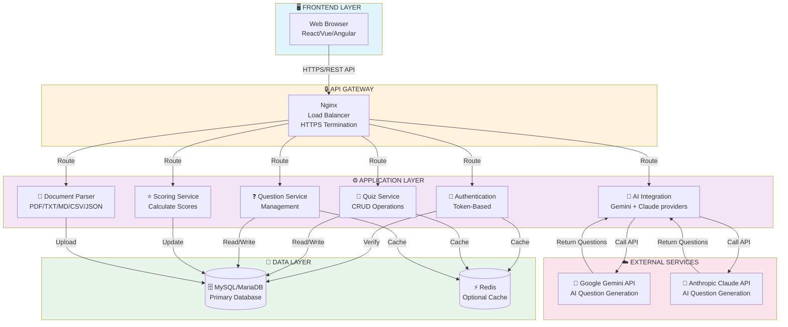

# SMART QUIZ GENERATOR

**CSE4204-8D-T04** | **Batch 8D** | **Team 04**

**SMART QUIZ GENERATOR** is an intelligent, role-based quiz management system that streamlines the process of creating, administering, and evaluating quizzes. The system leverages AI technology — with **two interchangeable providers, Google Gemini and Anthropic Claude** — to automatically generate quiz questions from various document formats while providing a secure, user-friendly platform for educators and students.

> 📌 **All AI logic lives in one place:** the [`backend/ai_integration/`](backend/ai_integration/) package. See its [README](backend/ai_integration/README.md) for the full design.

---

## 📋 Table of Contents

- [Project Overview](#project-overview)
- [Team Information](#team-information)
- [Key Features](#key-features)
- [Technology Stack](#technology-stack)
- [Repository Structure](#repository-structure)
- [Getting Started](#getting-started)
- [API Documentation](#api-documentation)
- [Database Schema](#database-schema)
- [Deployment](#deployment)

---

## Project Overview

### Objectives

- Enable efficient quiz creation through both manual input and AI-powered automatic generation from documents
- Implement secure role-based access control with distinct teacher and student workflows
- Provide intelligent question generation using Gemini or Claude AI (provider is configurable)
- Facilitate secure student assessment with real-time scoring and tracking
- Support multiple file formats (PDF, TXT, MD, CSV, JSON) for document-based question generation
- Deliver comprehensive REST API endpoints for seamless third-party integration

### Problem Statement

Traditional quiz creation and administration processes are time-consuming and resource-intensive. Educators spend significant time manually creating questions and managing student assessments. Without proper centralized platform and role-based access control, institutions lack secure mechanisms to manage the complete quiz lifecycle with intelligent automation.

### Key Benefits

✅ **Automated Question Generation** - Leverage AI to extract questions from documents  
✅ **Role-Based Access Control** - Secure separation between teacher and student workflows  
✅ **Multi-Format Support** - Parse PDF, TXT, Markdown, CSV, and JSON files  
✅ **Real-Time Scoring** - Instant feedback and score calculation  
✅ **API-First Design** - Easy integration with frontend apps and third-party services  
✅ **Secure Authentication** - Token-based auth with encrypted credentials  

---

## Development Team Details

This university project was created by team **CSE4204-8D-T04**.

### Team Members

| No. | Name | Student ID | Role / Responsibility | Email |
|---|---|---|---|---|
| 1 | MD Rohan | 11220320958 | Backend Developer, Full Stack Development | therohansec@gmail.com |
| 2 | Sharmin Nahar Tumpa | 11220320962 | AI Integration | tumpa540264@gmail.com |
| 3 | Pial Tarofdar | 11220320965 | Frontend Developer | pialtarofdar55@gmail.com |
| 4 | Sanjana Athoy | 11220320953 | Overall Technical Help | sanjanaathoy55@gmail.com |

---

## Key Features

### For Teachers

- ✅ Create, update, and delete quizzes
- ✅ Add questions with multiple-choice options
- ✅ Generate questions automatically from uploaded documents
- ✅ Set quiz difficulty levels and time duration
- ✅ Activate/deactivate quizzes
- ✅ Review all student submissions and attempt history
- ✅ Analyze student performance data

### For Students

- ✅ View list of active quizzes
- ✅ Take quizzes without seeing correct answers
- ✅ Submit responses with instant scoring
- ✅ View scores and performance feedback
- ✅ Track progress across multiple quizzes
- ✅ Review explanations for correct answers

### System Features

- ✅ AI-powered quiz generation from documents
- ✅ Support for PDF, TXT, Markdown, CSV, JSON formats
- ✅ Pluggable AI providers — Google Gemini (default) and Anthropic Claude
- ✅ Per-request or global provider selection (`provider` field / `AI_PROVIDER` env)
- ✅ Token-based authentication and authorization
- ✅ RESTful API endpoints with comprehensive documentation
- ✅ Role-based access control (Teacher/Student)
- ✅ Real-time quiz scoring and result calculation
- ✅ Complete attempt history and audit trail

---

## Technology Stack

### Backend

| Component | Technology |
|-----------|-----------|
| Framework | Django 4.2 |
| API | Django REST Framework (DRF) |
| Authentication | Django REST Framework Token |
| Database | MySQL 5.7+ / MariaDB 10.3+ |
| Language | Python 3.9+ |
| AI Integration | Google Gemini API (REST) + Anthropic Claude (`anthropic` SDK) |
| File Processing | pypdf, plus stdlib text/csv/json decoding |
| PDF reports (dev tool) | fpdf2 |

### Frontend (To Be Developed Separately)

| Component | Recommendation |
|-----------|-----------------|
| Framework | React, Vue, or Angular |
| HTTP Client | Axios or Fetch API |
| State Management | Redux, Vuex, or Context API |
| UI Framework | Material-UI, Bootstrap, or Tailwind CSS |

### DevOps & Deployment

- **Version Control:** Git/GitHub
- **Container:** Docker
- **Web Server:** Gunicorn, Nginx
- **Task Queue:** Celery (future enhancement)
- **Monitoring:** Django Debug Toolbar, logging

---

## Repository Structure

```
CSE4204-8D-T04-SMART-QUIZ-GENERATOR/
├── README.md                                    # Project overview
├── sample_data.sql                              # Sample database seed script
├── CSE4204-8D-T04_SRS.md                       # Software Requirements Specification
├── backend/
│   ├── manage.py                                # Django management script
│   ├── requirements.txt                         # Python dependencies
│   ├── manual_api_test.py                       # End-to-end backend smoke test (no frontend)
│   ├── ai_integration/                          # ⭐ ALL AI logic (provider-agnostic package)
│   │   ├── __init__.py                          # Public API (generate_quiz, etc.)
│   │   ├── README.md                            # AI integration design document
│   │   ├── documents.py                         # File -> text extraction (AI input pipeline)
│   │   ├── prompts.py                           # Provider-neutral prompt builder
│   │   ├── validation.py                        # Shared quiz JSON schema + validation
│   │   ├── gemini.py                            # Google Gemini provider
│   │   ├── claude.py                            # Anthropic Claude provider
│   │   ├── providers.py                         # generate_quiz() dispatcher
│   │   └── generate_sample_quizzes_pdf.py       # CLI: generate sample quizzes -> PDF
│   ├── quiz_api/                                # Main Django app (web layer)
│   │   ├── __init__.py
│   │   ├── admin.py                             # Django admin configuration
│   │   ├── apps.py                              # App configuration
│   │   ├── models.py                            # Database models (Quiz, Question, QuizAttempt)
│   │   ├── permissions.py                       # Custom permission classes
│   │   ├── serializers.py                       # DRF serializers
│   │   ├── tests.py                             # Unit tests
│   │   ├── urls.py                              # URL routing
│   │   ├── views.py                             # API endpoints (calls ai_integration)
│   │   └── migrations/                          # Database migrations
│   │       ├── __init__.py
│   │       ├── 0001_initial.py                  # Initial schema
│   │       └── 0002_create_roles.py             # Role setup
│   └── smart_quiz_backend/
│       ├── __init__.py
│       ├── asgi.py                              # ASGI configuration
│       ├── settings.py                          # Django settings (AI keys + provider)
│       ├── urls.py                              # Global URL configuration
│       └── wsgi.py                              # WSGI configuration
├── docs/
│   ├── AI_INTEGRATION_GUIDE.md                  # Gemini API integration guide
│   ├── BACKEND_API_REFERENCE.md                 # Complete API documentation
│   ├── DATABASE_ARCHITECTURE.md                 # Database schema details
│   └── FRONTEND_DEVELOPER_GUIDE.md              # Frontend integration guide
└── .gitignore                                   # Git ignore rules
```

---

## Getting Started

### Prerequisites

- Python 3.9+
- MySQL 5.7+ or MariaDB 10.3+
- Git
- pip (Python package manager)

### Local Setup

1. **Clone the repository:**
   ```bash
   git clone https://github.com/YOUR_ORG/CSE4204-8D-T04-SMART-QUIZ-GENERATOR.git
   cd CSE4204-8D-T04-SMART-QUIZ-GENERATOR
   ```

2. **Set up Python virtual environment:**
   ```bash
   python -m venv venv
   source venv/bin/activate  # On Windows: venv\Scripts\activate
   ```

3. **Install dependencies:**
   ```bash
   cd backend
   pip install -r requirements.txt
   ```

4. **Configure environment variables:**
   Create a `.env` file in the `backend/` directory:
   ```dotenv
   DJANGO_DEBUG=1
   DJANGO_SECRET_KEY=your-secret-key-here
   DB_NAME=smart_quiz_generator
   DB_USER=root
   DB_PASSWORD=your-password
   DB_HOST=127.0.0.1
   DB_PORT=3306

   # --- AI providers ---
   AI_PROVIDER=gemini                 # default provider: gemini | claude

   # Google Gemini
   GEMINI_API_KEY=your-gemini-api-key
   GEMINI_MODEL=gemini-2.5-flash      # optional
   GEMINI_TIMEOUT=30                  # optional

   # Anthropic Claude (only needed if you use the claude provider)
   ANTHROPIC_API_KEY=your-anthropic-api-key
   CLAUDE_MODEL=claude-opus-4-8       # optional
   ```

5. **Run migrations:**
   ```bash
   python manage.py migrate
   ```

6. **Create superuser:**
   ```bash
   python manage.py createsuperuser
   ```

7. **Load sample data (optional):**
   ```bash
   mysql -u root -p smart_quiz_db < ../sample_data.sql
   ```

8. **Start the development server:**
   ```bash
   python manage.py runserver
   ```

   The API will be available at `http://localhost:8000/api/`

### Running Tests

```bash
python manage.py test quiz_api
```

---

## API Documentation

### Base URL
```
http://localhost:8000/api/
```

### Authentication

All protected endpoints require a token in the Authorization header:
```
Authorization: Token YOUR_AUTH_TOKEN
```

### Key Endpoints

#### Authentication
- `POST /auth/register/` - Register new user
- `POST /auth/login/` - Login and get token
- `POST /auth/logout/` - Logout and invalidate token

#### Quizzes (Teacher)
- `GET /quizzes/` - List all quizzes
- `POST /quizzes/` - Create new quiz
- `GET /quizzes/{id}/` - Retrieve quiz details
- `PUT /quizzes/{id}/` - Update quiz
- `DELETE /quizzes/{id}/` - Delete quiz

#### Questions (Teacher)
- `GET /quizzes/{quiz_id}/questions/` - List questions
- `POST /quizzes/{quiz_id}/questions/` - Add question
- `PUT /quizzes/{quiz_id}/questions/{id}/` - Update question
- `DELETE /quizzes/{quiz_id}/questions/{id}/` - Delete question

#### AI Question Generation
- `POST /quizzes/{quiz_id}/generate-questions/` - Generate from document

#### Quiz Taking (Student)
- `GET /quizzes/{id}/questions-safe/` - Get questions (without answers)
- `POST /quizzes/{id}/submit/` - Submit quiz attempt

#### Attempts & Scoring
- `GET /attempts/` - List all attempts (with filtering)
- `GET /attempts/{id}/` - View attempt details

**For complete API documentation, see [BACKEND_API_REFERENCE.md](docs/BACKEND_API_REFERENCE.md)**

---

## Database Schema

### Core Tables

**quiz_api_quiz**
- Stores quiz metadata (title, description, difficulty, duration, active status, timestamps)

**quiz_api_question**
- Stores questions linked to quizzes (prompt, options A-D, correct answer, explanation, order)

**quiz_api_quizattempt**
- Stores student submissions (student name, responses JSON, score, total, timestamp)

**auth_user**
- Django's user authentication table

**authtoken_token**
- Token-based authentication

**For detailed schema, see [DATABASE_ARCHITECTURE.md](docs/DATABASE_ARCHITECTURE.md)**

---

## Deployment

### Production Setup

1. **Set DEBUG=False in settings**
2. **Configure environment variables**
3. **Use Gunicorn as application server**
4. **Set up Nginx as reverse proxy**
5. **Enable HTTPS with SSL certificates**
6. **Configure database backups**
7. **Set up monitoring and logging**

### Docker Deployment (Optional)

```dockerfile
# Dockerfile
FROM python:3.9
WORKDIR /app
COPY requirements.txt .
RUN pip install -r requirements.txt
COPY . .
CMD ["gunicorn", "smart_quiz_backend.wsgi:application", "--bind", "0.0.0.0:8000"]
```

---

## Documentation

-  **[Software Requirements Specification (SRS)](CSE4204-8D-T04_SRS.md)** - Complete requirements document
-  **[AI Integration (package design)](backend/ai_integration/README.md)** - How Gemini + Claude are implemented
-  **[API Reference](docs/BACKEND_API_REFERENCE.md)** - Detailed API documentation
-  **[Database Architecture](docs/DATABASE_ARCHITECTURE.md)** - Schema and relationships
-  **[AI Integration Guide](docs/AI_INTEGRATION_GUIDE.md)** - Gemini API setup
-  **[Frontend Developer Guide](docs/FRONTEND_DEVELOPER_GUIDE.md)** - Integration instructions

---

##  System Diagrams

###  Quick Links to All Diagrams

All diagrams are in the **`/diagrams/`** folder. **[View Diagrams Folder →](diagrams/)**

| Diagram | Description | Use Case |
|---------|-------------|----------|
|  [Quick Overview](diagrams/00-ARCHITECTURE-OVERVIEW.md) | 5-layer system architecture | Start here! Quick understanding |
|  [Use Case](diagrams/CSE4204-8D-T04_USE_CASE_DIAGRAM.md) | 3 actors, 15 use cases | What the system does |
|  [ER Diagram](diagrams/CSE4204-8D-T04_ER-DIAGRAM.md) | 7 entities, relationships | Database schema |
|  [Architecture](diagrams/CSE4204-8D-T04_ARCHITECTURE-DIAGRAM.md) | 5 layers, 10+ services | Complete system design |

** [→ Open Diagrams Folder](diagrams/)** to view and read all diagrams with detailed explanations.

### Quick Architecture Overview



### Key Workflows

-  **Teacher:** Create quiz → Add questions → Generate from docs → Review attempts
-  **Student:** View quizzes → Take quiz → Submit → View score
-  **System:** Validate → Score → Generate AI questions

**For detailed diagrams with full explanations, see the [diagrams folder →](diagrams/)**

---

## Contributing

1. Follow PEP 8 style guidelines
2. Write unit tests for new features
3. Update documentation
4. Create feature branches: `feature/feature-name`
5. Submit pull requests for review

---

## Testing

- **Unit Tests:** `python manage.py test quiz_api`
- **Coverage Report:** `coverage run --source='.' manage.py test && coverage report`
- **Minimum Coverage:** 80%

---

## Support & Troubleshooting

For common issues and solutions, refer to the [Backend Developer Guide](docs/BACKEND_API_REFERENCE.md).

---

## License

This project is part of CSE4204 Course Assignment. All rights reserved by the course instructors.

---


- Django 4.2.17
- Django REST Framework
- django-cors-headers
- PyMySQL
- MySQL or MariaDB on XAMPP

## Frontend (Upcoming)
- React.js
## AI integration (Implemented)
- Google Gemini (default) and Anthropic Claude — see [backend/ai_integration/](backend/ai_integration/README.md)
## Deployment (Upcoming)
- Railway/Render

### Data model summary

- **Quiz**: quiz metadata such as title, difficulty, duration, and active status.
- **Question**: MCQ content, four answer options, correct option, explanation, and order.
- **QuizAttempt**: saved student responses, score, total, and timestamp.

### Database architecture

A dedicated database architecture guide lives in [docs/DATABASE_ARCHITECTURE.md](docs/DATABASE_ARCHITECTURE.md). It documents the tables, relationships, and role/auth schema used by the Django backend.

### API entry point

- Base URL: `http://127.0.0.1:8001/api`

### Important routes

- `GET /api/quizzes/` — list quizzes
- `POST /api/quizzes/` — create a quiz
- `GET /api/quizzes/<id>/` — retrieve a quiz
- `GET /api/quizzes/<id>/questions/` — list questions for a quiz
- `POST /api/quizzes/<id>/questions/` — create a question for a quiz
- `GET /api/quizzes/<id>/student-questions/` — fetch student-safe questions only
- `POST /api/quizzes/<id>/submit/` — submit answers and calculate the score
- `GET /api/quizzes/<id>/attempts/` — list quiz attempts
- `POST /api/documents/parse/` — upload and parse a PDF or text file
- `POST /api/ai/generate-quiz/` — generate a quiz using AI (Gemini or Claude)

---

## Backend setup on XAMPP

### 1. Start XAMPP services

Start **Apache** and **MySQL** from the XAMPP control panel.

### 2. Create the database

Open a MySQL shell and create the database:

```sql
CREATE DATABASE smart_quiz_generator CHARACTER SET utf8mb4 COLLATE utf8mb4_unicode_ci;
```

### 3. Create the Python environment

```powershell
cd D:\SMART-QUIZ-GENERATOR
python -m venv .venv
.\.venv\Scripts\Activate.ps1
pip install -r backend\requirements.txt
```

> Always use the virtualenv interpreter for backend commands. The backend should be started with `D:\SMART-QUIZ-GENERATOR\.venv\Scripts\python.exe`, not the system `python` command.

### 4. Configure environment variables

Use PowerShell to set the backend environment before starting Django:

```powershell
$env:DB_NAME = "smart_quiz_generator"
$env:DB_USER = "root"
$env:DB_PASSWORD = ""
$env:DB_HOST = "127.0.0.1"
$env:DB_PORT = "3306"
$env:DJANGO_DEBUG = "1"
$env:CORS_ALLOWED_ORIGINS = "http://127.0.0.1:3000,http://localhost:3000"
```

Add AI provider settings when you want AI generation enabled.

Gemini (default provider):

```powershell
$env:GEMINI_API_KEY = "your-api-key"
$env:GEMINI_MODEL = "gemini-2.5-flash"
$env:GEMINI_TIMEOUT = "30"
```

Claude (optional second provider):

```powershell
$env:AI_PROVIDER = "claude"          # make Claude the default, or send "provider":"claude" per request
$env:ANTHROPIC_API_KEY = "your-anthropic-key"
$env:CLAUDE_MODEL = "claude-opus-4-8"
```

> If your XAMPP root user has a password, replace the blank password with your actual password.

### 5. Apply migrations

```powershell
cd backend
python manage.py migrate
```

### 6. Load sample data

```powershell
mysql -u root -p smart_quiz_generator < ..\sample_data.sql
```

If your XAMPP root user has no password, use:

```powershell
mysql -u root smart_quiz_generator < ..\sample_data.sql
```

### 7. Start the backend

```powershell
cd backend
D:\SMART-QUIZ-GENERATOR\.venv\Scripts\python.exe manage.py runserver 8001
```

You should see Django running on `http://127.0.0.1:8001/`.

### 8. Register and log in

Use the auth endpoints to create a teacher or student account and get a token.

```powershell
$register = '{"username":"teacher1","password":"Test@123","role":"teacher"}'
Invoke-WebRequest -Method POST -ContentType "application/json" -Body $register http://127.0.0.1:8001/api/auth/register/ | Select-Object -ExpandProperty Content

$login = '{"username":"teacher1","password":"Test@123"}'
Invoke-WebRequest -Method POST -ContentType "application/json" -Body $login http://127.0.0.1:8001/api/auth/login/ | Select-Object -ExpandProperty Content
```

Use the returned token in later requests:

```powershell
$headers = @{ Authorization = "Token YOUR_TOKEN" }
Invoke-WebRequest -Headers $headers http://127.0.0.1:8001/api/quizzes/ | Select-Object -ExpandProperty Content
```

---

## How to test the backend

### Basic verification

Run these checks after the server starts.

#### 1. Verify the API is alive

```powershell
Invoke-WebRequest http://127.0.0.1:8001/api/quizzes/ | Select-Object -ExpandProperty Content
```

#### 2. Verify the student-safe endpoint

```powershell
Invoke-WebRequest http://127.0.0.1:8001/api/quizzes/1/student-questions/ | Select-Object -ExpandProperty Content
```

#### 3. Verify quiz submission

```powershell
$body = '{"student_name":"Test Student","answers":[{"question":1,"selected_option":"B"}]}'
Invoke-WebRequest -Method POST -ContentType "application/json" -Body $body http://127.0.0.1:8001/api/quizzes/1/submit/ | Select-Object -ExpandProperty Content
```

#### 4. Verify AI generation

```powershell
$body = '{"title":"AI Test Quiz","difficulty":"Medium","question_count":2,"topic":"Science","syllabus":"Cells and planets","instruction":"Generate two clear MCQs.","duration_minutes":5}'
Invoke-WebRequest -Method POST -ContentType "application/json" -Body $body http://127.0.0.1:8001/api/ai/generate-quiz/ | Select-Object -ExpandProperty Content
```

If `GEMINI_API_KEY` is not set, the response will be `503` and the body will contain `GEMINI_API_KEY is not configured.`

#### 5. Verify document parsing

```powershell
$headers = @{ Authorization = "Token YOUR_TOKEN" }
$files = @{ file = Get-Item .\sample.txt }
Invoke-RestMethod -Method POST -Headers $headers -Form $files http://127.0.0.1:8001/api/documents/parse/
```

### What a healthy backend looks like

A healthy backend should show:

- `GET /api/quizzes/` returns JSON quiz objects.
- `GET /api/quizzes/<id>/student-questions/` returns only question text and options.
- `POST /api/quizzes/<id>/submit/` returns a score and attempt details.
- `POST /api/ai/generate-quiz/` returns `201` once Gemini is configured.

---

## How to build the frontend separately

This repository does not contain the UI anymore. Build the frontend as a separate project and make it call the backend APIs.

### Recommended frontend approach

- Use **React + Vite**, **Vue**, or plain HTML/JS if you want a lightweight starter.
- Keep the frontend in its own folder or repository.
- Store the API base URL in one place.
- Use the backend only for data and AI generation.
- Never place `GEMINI_API_KEY` on the client.

### Frontend responsibilities

- Teacher dashboard: create quizzes, add questions, view attempts.
- Student portal: list quizzes, fetch student-safe questions, submit answers.
- Results screen: show scores and attempt history.

### CORS requirements

Add your frontend origin to `CORS_ALLOWED_ORIGINS`, for example:

```powershell
$env:CORS_ALLOWED_ORIGINS = "http://127.0.0.1:3000,http://localhost:3000"
```

### Frontend integration guide

See [docs/FRONTEND_DEVELOPER_GUIDE.md](docs/FRONTEND_DEVELOPER_GUIDE.md) for a detailed frontend contract and example API usage.

---

## AI Integration (Gemini + Claude)

The AI flow is **server-side only** and lives entirely in the
[`backend/ai_integration/`](backend/ai_integration/) package. The Django web
layer never talks to a model directly — it calls one function, `generate_quiz()`,
which selects a provider and delegates. The full design is documented in
[backend/ai_integration/README.md](backend/ai_integration/README.md).

### Supported providers

| Provider | Default model | How it produces JSON | Dependency |
|----------|---------------|----------------------|------------|
| **Google Gemini** (default) | `gemini-2.5-flash` | Prompted for JSON; response parsed and markdown fences stripped | none (stdlib `urllib`) |
| **Anthropic Claude** | `claude-opus-4-8` | Structured outputs (`output_config.format`) — schema-enforced JSON | `anthropic` SDK |

Gemini is the default, so existing behaviour is unchanged. Claude is opt-in.

### Current AI behavior

1. The client sends generation details to `POST /api/ai/generate-quiz/` (teacher only).
2. The view reads the request (including an optional `"provider"` field) and calls
   `generate_quiz(payload, provider)`.
3. The dispatcher routes to the Gemini or Claude provider, which builds the prompt
   and calls the model.
4. The response runs through one shared validation gate (`validate_generated_quiz`).
5. The backend creates a `Quiz` record and linked `Question` records.
6. The backend returns the created quiz and generated questions (`201`).

### Choosing a provider

- **Globally:** set `AI_PROVIDER=gemini` or `AI_PROVIDER=claude` in the environment.
- **Per request:** add `"provider": "claude"` (or `"gemini"`) to the POST body — this
  overrides `AI_PROVIDER` for that one call.

### Environment variables

| Variable | Provider | Required? | Default |
|----------|----------|-----------|---------|
| `AI_PROVIDER` | dispatcher | optional | `gemini` |
| `GEMINI_API_KEY` | Gemini | required for Gemini | — |
| `GEMINI_MODEL` | Gemini | optional | `gemini-2.5-flash` |
| `GEMINI_TIMEOUT` | Gemini | optional | `30` |
| `ANTHROPIC_API_KEY` | Claude | required for Claude | — |
| `CLAUDE_MODEL` | Claude | optional | `claude-opus-4-8` |

If a provider's key is missing, that provider returns **HTTP 503** with a clear
message (e.g. `GEMINI_API_KEY is not configured.`) instead of crashing.

### AI validation rules (both providers)

- Exactly four options are required.
- `correct_option` must be `A`, `B`, `C`, or `D` (normalised to uppercase).
- The generated payload must include a non-empty title.
- The response must contain the requested number of questions.

### Reviewing quiz quality (PDF tool)

Generate real quizzes and export them to PDF for review — no frontend or database needed:

```powershell
cd backend
python ai_integration/generate_sample_quizzes_pdf.py                       # default topics, gemini
python ai_integration/generate_sample_quizzes_pdf.py "Quantum physics"     # custom topic
python ai_integration/generate_sample_quizzes_pdf.py --provider claude "Cell biology"
```

PDFs are written to `backend/sample_quizzes/`.

See [backend/ai_integration/README.md](backend/ai_integration/README.md) and
[docs/AI_INTEGRATION_GUIDE.md](docs/AI_INTEGRATION_GUIDE.md) for full details.

---

## Documentation

- [AI Integration (package design)](backend/ai_integration/README.md)
- [Backend API Reference](docs/BACKEND_API_REFERENCE.md)
- [Frontend Developer Guide](docs/FRONTEND_DEVELOPER_GUIDE.md)
- [Gemini AI Integration Guide](docs/AI_INTEGRATION_GUIDE.md)

---

## Important notes

- The backend currently uses `AllowAny` for API access, so authentication is still missing.
- Use the sample SQL script at the project root to seed a local testing database.
- The current backend is designed for local development and should be hardened before production deployment.

