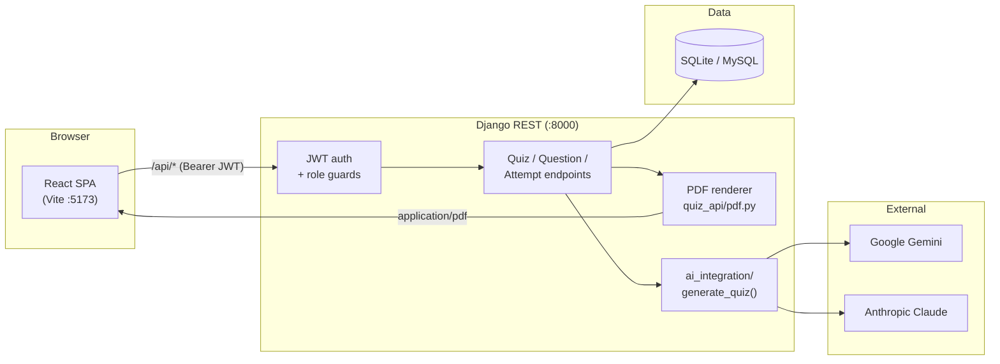

# SMART QUIZ GENERATOR

**CSE4204-8D-T04** | **Batch 8D** | **Team 04**
*CSE4204 — Mobile Computing Lab · Department of CSE · Northern University of Business and Technology, Khulna*

**SMART QUIZ GENERATOR** is a role-based quiz platform. Teachers create quizzes — by hand or by
generating them from a topic or an uploaded document with **AI (Google Gemini or Anthropic Claude)** —
publish them, and export them as **print-ready PDFs**. Students take those quizzes in the browser and
get scored instantly with per-question explanations.

It is a complete stack: **React (Vite) frontend + Django REST backend + SQL database**, wired together
and covered by tests.

---

## Table of Contents

- [Screens & Features](#screens--features)
- [Team](#team)
- [Technology Stack](#technology-stack)
- [Quick Start](#quick-start)
- [Configuration](#configuration)
- [How the Pieces Fit Together](#how-the-pieces-fit-together)
- [API Reference](#api-reference)
- [PDF Export](#pdf-export)
- [AI Integration](#ai-integration)
- [Database](#database)
- [Testing](#testing)
- [Repository Structure](#repository-structure)
- [Documentation](#documentation)

---

## Screens & Features

### Teacher

| Screen | What it does |
|---|---|
| **Dashboard** (`/`) | Live counters (quizzes, questions, attempts, average score) and the quiz table: publish/unpublish, export PDF, view student results, delete. |
| **Create Quiz** (`/create-quiz`) | Configure a quiz (topic, difficulty, count, duration, provider), optionally upload a **PDF/TXT/MD/CSV/JSON** source document, then generate with AI. Review the questions, then publish, export, or discard. |
| **Question Bank** (`/question-bank`) | Every question across your quizzes. Filter by quiz, search, add a question manually, delete. |
| **Profile / Settings** | Account details and your activity totals. |

### Student

| Screen | What it does |
|---|---|
| **Quizzes** (`/student`) | Every quiz a teacher has **published**, with your personal stats (taken, average, best). |
| **Take Quiz** (`/quiz/:id`) | Answer the quiz with a live countdown timer (auto-submits at zero) and a progress bar. Correct answers are **never sent to the browser** before submitting. |
| **Results** | Instant score, plus a per-question review showing what you chose, the right answer, and why. |
| **My Attempts** (`/attempts`) | Your full attempt history. Students only ever see their own. |

### Security model

- **JWT auth** (access + refresh) with automatic, transparent token refresh in the frontend, and refresh-token blacklisting on logout.
- **Role-based access** (`teacher` / `student`), enforced on the server for *every* endpoint — the frontend guards are a convenience, not the control.
- **Quiz ownership** — a teacher can only modify or delete quizzes they created.
- **Attempts are bound to the authenticated user** — a student cannot submit an attempt under someone else's name.
- **Draft by default** — a new quiz is invisible to students until explicitly published.

---

## Team

| No. | Name | Student ID | Role | Email |
|---|---|---|---|---|
| 1 | MD Rohan | 11220320958 | Backend Developer, Full Stack | therohansec@gmail.com |
| 2 | Sharmin Nahar Tumpa | 11220320962 | AI Integration | tumpa540264@gmail.com |
| 3 | Pial Tarofdar | 11220320965 | Frontend Developer | pialtarofdar55@gmail.com |
| 4 | Sanjana Athoy | 11220320953 | Technical Support | sanjanaathoy55@gmail.com |

> The team identity is defined **once**, in `TEAM` in [`backend/smart_quiz_backend/settings.py`](backend/smart_quiz_backend/settings.py).
> It is served at `GET /api/meta/` and is stamped onto the footer of every exported PDF and the footer of
> every screen in the app — so it can never drift out of sync.

---

## Technology Stack

| Layer | Technology |
|---|---|
| **Frontend** | React 18, Vite 5, React Router 7, lucide-react |
| **Backend** | Django 4.2, Django REST Framework |
| **Auth** | JWT — `djangorestframework-simplejwt` (access + refresh + blacklist) |
| **Database** | SQLite (default, zero-setup) **or** MySQL 5.7+ / MariaDB 10.3+ |
| **AI** | Google Gemini (REST) + Anthropic Claude (`anthropic` SDK) |
| **Documents** | `pypdf` + stdlib text/csv/json decoding |
| **PDF export** | `fpdf2` |

---

## Quick Start

You need **Python 3.9+** and **Node.js 18+**. You do *not* need MySQL or XAMPP to run the project.

### 1. Backend

```bash
git clone https://github.com/theuglyhaxor/CSE4204-8D-T04-SMART-QUIZ-GENERATOR.git
cd CSE4204-8D-T04-SMART-QUIZ-GENERATOR

python -m venv .venv
# Windows:
.\.venv\Scripts\Activate.ps1
# macOS/Linux:
source .venv/bin/activate

pip install -r backend/requirements.txt

cd backend
cp .env.example .env        # Windows: copy .env.example .env
python manage.py migrate
python manage.py runserver  # http://127.0.0.1:8000
```

That's it — the default `DB_ENGINE=sqlite` needs no database server.

### 2. Frontend

In a **second terminal**:

```bash
cd frontend
npm install
npm run dev                 # http://127.0.0.1:5173
```

Open **http://127.0.0.1:5173**, click **Sign up**, choose **Teacher** or **Student**, and you're in.

> The Vite dev server proxies `/api` → `http://127.0.0.1:8000` (see [`frontend/vite.config.js`](frontend/vite.config.js)),
> so the browser only ever talks to one origin and **CORS never comes into play in development**.

### 3. Enable AI generation (optional)

Quiz *creation* works without any API key; only **AI generation** needs one. Add to `backend/.env`:

```dotenv
AI_PROVIDER=gemini
GEMINI_API_KEY=your-key-here
```

Without a key, `POST /api/ai/generate-quiz/` returns a clear **503** (`GEMINI_API_KEY is not configured.`)
instead of crashing.

---

## Configuration

All backend settings come from `backend/.env` — see [`backend/.env.example`](backend/.env.example).

| Variable | Default | Notes |
|---|---|---|
| `DB_ENGINE` | `sqlite` | `sqlite` (no setup) or `mysql` |
| `DB_NAME` / `DB_USER` / `DB_PASSWORD` / `DB_HOST` / `DB_PORT` | — | Only used when `DB_ENGINE=mysql` |
| `DJANGO_DEBUG` | `1` | Set `0` in production |
| `DJANGO_SECRET_KEY` | dev key | **Must** be changed in production |
| `CORS_ALLOWED_ORIGINS` | `http://127.0.0.1:5173,http://localhost:5173` | Only needed if you *don't* use the Vite proxy |
| `AI_PROVIDER` | `gemini` | `gemini` or `claude` |
| `GEMINI_API_KEY` / `GEMINI_MODEL` | — / `gemini-2.5-flash` | Required for Gemini |
| `ANTHROPIC_API_KEY` / `CLAUDE_MODEL` | — / `claude-opus-4-8` | Required for Claude |

### Using MySQL / XAMPP instead of SQLite

Start MySQL, create the database, then flip `DB_ENGINE`:

```sql
CREATE DATABASE smart_quiz_generator CHARACTER SET utf8mb4 COLLATE utf8mb4_unicode_ci;
```

```dotenv
DB_ENGINE=mysql
DB_NAME=smart_quiz_generator
DB_USER=root
DB_PASSWORD=
```

```bash
python manage.py migrate
```

The DDL that these migrations produce is documented in [`database/schema.sql`](database/schema.sql).

### Frontend

| Variable | Default | Notes |
|---|---|---|
| `VITE_API_BASE_URL` | `/api` | Leave as-is to use the dev proxy. Set to a full URL (e.g. `https://api.example.com/api`) for a deployed backend. |
| `VITE_BACKEND_URL` | `http://127.0.0.1:8000` | Where the dev proxy forwards `/api`. |

---

## How the Pieces Fit Together



**Key flows**

- **Teacher generates a quiz:** `POST /api/ai/generate-quiz/` → `ai_integration.generate_quiz()` picks the
  provider → the model returns JSON → one shared validation gate → the `Quiz` + `Question` rows are saved
  as a **draft** and returned. The teacher reviews, then publishes.
- **Student takes a quiz:** `GET /api/quizzes/:id/student-questions/` (answers stripped out) →
  `POST /api/quizzes/:id/submit/` → the server scores it, stores the attempt against the **authenticated
  user**, and returns the score plus the correct answers and explanations.
- **PDF export:** `GET /api/quizzes/:id/export-pdf/` renders through `quiz_api/pdf.py`, the *same* renderer
  the offline review CLI uses.

---

## API Reference

Base URL: `http://127.0.0.1:8000/api`
All protected endpoints require `Authorization: Bearer <access_token>`.

### Meta

| Method | Endpoint | Access | Purpose |
|---|---|---|---|
| `GET` | `/meta/` | public | Team identity (drives the app + PDF footers) |
| `GET` | `/stats/` | teacher/student | Dashboard counters (shape depends on role) |

### Auth

| Method | Endpoint | Access | Purpose |
|---|---|---|---|
| `POST` | `/auth/register/` | public | Create an account (`role`: `teacher` \| `student`) → returns `access` + `refresh` + `user` |
| `POST` | `/auth/login/` | public | Log in → returns `access` + `refresh` + `user` |
| `GET` | `/auth/me/` | any | Current user — used to restore a session from a stored token |
| `POST` | `/auth/token/refresh/` | public | Exchange a refresh token for a new access token |
| `POST` | `/auth/logout/` | any | Blacklist the refresh token |

### Quizzes

| Method | Endpoint | Access | Purpose |
|---|---|---|---|
| `GET` | `/quizzes/` | teacher/student | List quizzes. **Students only see published ones.** |
| `POST` | `/quizzes/` | teacher | Create a quiz (starts as a **draft**) |
| `GET` | `/quizzes/{id}/` | teacher/student | Retrieve a quiz |
| `PATCH` | `/quizzes/{id}/` | teacher (owner) | Update — e.g. `{"is_active": true}` to publish |
| `DELETE` | `/quizzes/{id}/` | teacher (owner) | Delete the quiz, its questions and attempts |
| `GET` | `/quizzes/{id}/export-pdf/` | teacher/student | **Download the quiz as a PDF.** `?answers=false` for the student handout |

### Questions

| Method | Endpoint | Access | Purpose |
|---|---|---|---|
| `GET` | `/quizzes/{id}/questions/` | teacher | Questions for one quiz (with answers) |
| `POST` | `/quizzes/{id}/questions/` | teacher (owner) | Add a question (`order` is auto-assigned) |
| `GET` | `/quizzes/{id}/student-questions/` | teacher/student | Questions **without** `correct_option` / `explanation` |
| `GET` | `/questions/?quiz={id}` | teacher | Flat question list (Question Bank) |
| `PATCH`/`DELETE` | `/questions/{id}/` | teacher | Update / delete a question |

### Attempts

| Method | Endpoint | Access | Purpose |
|---|---|---|---|
| `POST` | `/quizzes/{id}/submit/` | student | Submit answers → scored immediately |
| `GET` | `/quizzes/{id}/attempts/` | teacher | Every attempt at that quiz |
| `GET` | `/attempts/me/` | student | **Only the caller's own** attempts |

### Documents & AI

| Method | Endpoint | Access | Purpose |
|---|---|---|---|
| `POST` | `/documents/parse/` | teacher | Upload a PDF/TXT/MD/CSV/JSON → extracted text |
| `POST` | `/ai/generate-quiz/` | teacher | Generate + save a quiz. Optional `"provider": "gemini"\|"claude"` |

Full detail: **[docs/BACKEND_API_REFERENCE.md](docs/BACKEND_API_REFERENCE.md)**

---

## PDF Export

Every quiz can be exported as a polished A4 PDF, in two variants:

| Variant | Request | Contents |
|---|---|---|
| **Answer key** (teacher) | `GET /api/quizzes/{id}/export-pdf/` | Correct option highlighted, explanations, and a full answer-key page |
| **Student handout** | `GET /api/quizzes/{id}/export-pdf/?answers=false` | Questions and options only — no answers, no explanations |

A student calling this endpoint **always** gets the handout, even if they ask for `answers=true`.

The document has a coloured title band, a metadata strip (difficulty / questions / duration / date / model),
numbered question badges, and a **team identity footer on every page** — team ID, project, course,
department and university — plus a closing credits block naming all four members. Unicode (curly quotes,
em-dashes, `H₂O`) renders correctly.

Both the API and the offline review CLI use the **same** renderer, [`backend/quiz_api/pdf.py`](backend/quiz_api/pdf.py),
so what a teacher downloads is exactly what you review offline:

```bash
cd backend
python ai_integration/generate_sample_quizzes_pdf.py                     # default topics
python ai_integration/generate_sample_quizzes_pdf.py "Quantum physics"   # custom topic
python ai_integration/generate_sample_quizzes_pdf.py --provider claude "Cell biology"
python ai_integration/generate_sample_quizzes_pdf.py --no-answers "Algebra"  # handout
```

PDFs are written to `backend/sample_quizzes/`.

---

## AI Integration

All AI logic lives in one place: the [`backend/ai_integration/`](backend/ai_integration/) package. The web
layer never talks to a model directly — it calls a single function, `generate_quiz(payload, provider)`.

| Provider | Default model | How it returns JSON | Dependency |
|---|---|---|---|
| **Google Gemini** (default) | `gemini-2.5-flash` | Prompted for JSON; fences stripped and parsed | none (stdlib `urllib`) |
| **Anthropic Claude** | `claude-opus-4-8` | Structured outputs — schema-enforced JSON | `anthropic` SDK |

**Choosing a provider** — globally with `AI_PROVIDER=gemini|claude`, or per request by adding
`"provider": "claude"` to the POST body.

**Validation gate (both providers):** exactly four options; `correct_option` must be `A`/`B`/`C`/`D`
(normalised to uppercase); a non-empty title; and the requested number of questions. A missing API key
returns **503** with a clear message rather than a crash.

Design detail: **[backend/ai_integration/README.md](backend/ai_integration/README.md)** ·
**[docs/AI_INTEGRATION.md](docs/AI_INTEGRATION.md)**

---

## Database

Django migrations own the schema — `python manage.py migrate` creates everything.

| Table | Purpose |
|---|---|
| `quiz_api_quiz` | Quiz metadata. `created_by_id` → owner. `is_active` → draft/published. |
| `quiz_api_question` | MCQ content: prompt, options A–D, `correct_option`, explanation, order. |
| `quiz_api_quizattempt` | A submission: `student_id` → submitter, `responses` JSON, score, total. |
| `auth_user`, `auth_group`, `auth_user_groups` | Django accounts + the `teacher` / `student` role groups. |
| `token_blacklist_*` | JWT refresh-token tracking and logout blacklist. |

Relationships:

```
USER (1) ──< QUIZ (M)           quiz.created_by_id      (a teacher owns their quizzes)
QUIZ (1) ──< QUESTION (M)       question.quiz_id        (CASCADE)
QUIZ (1) ──< QUIZATTEMPT (M)    quizattempt.quiz_id     (CASCADE)
USER (1) ──< QUIZATTEMPT (M)    quizattempt.student_id  (a student owns their attempts)
```

Reference DDL: **[database/schema.sql](database/schema.sql)** ·
Design notes: **[docs/DATABASE_ARCHITECTURE.md](docs/DATABASE_ARCHITECTURE.md)**

---

## Testing

```bash
cd backend
python manage.py test quiz_api
```

**32 tests**, covering registration and login, JWT refresh and logout blacklisting, role-based access
control, quiz ownership, draft visibility, question ordering and option normalisation, scoring, attempt
ownership (including rejecting a spoofed `student_name`), the stats endpoints, document parsing, and PDF
export in both variants.

```bash
cd frontend
npm run build      # production build
```

---

## Repository Structure

```
CSE4204-8D-T04-SMART-QUIZ-GENERATOR/
├── backend/
│   ├── manage.py
│   ├── requirements.txt
│   ├── .env.example                  # copy to .env
│   ├── ai_integration/               # ⭐ ALL AI logic (provider-agnostic)
│   │   ├── __init__.py               #    public API: generate_quiz(), extract_text_from_uploaded_file()
│   │   ├── documents.py              #    file → text (PDF/TXT/MD/CSV/JSON)
│   │   ├── prompts.py                #    provider-neutral prompt builder
│   │   ├── validation.py             #    shared quiz-JSON schema + validation gate
│   │   ├── gemini.py                 #    Google Gemini provider
│   │   ├── claude.py                 #    Anthropic Claude provider
│   │   ├── providers.py              #    generate_quiz() dispatcher
│   │   └── generate_sample_quizzes_pdf.py   # CLI: generate quizzes → PDF for review
│   ├── quiz_api/
│   │   ├── models.py                 # Quiz, Question, QuizAttempt
│   │   ├── serializers.py
│   │   ├── permissions.py            # IsTeacherUser / IsStudentUser / …
│   │   ├── views.py                  # all API endpoints
│   │   ├── pdf.py                    # ⭐ the shared PDF renderer (identity footer)
│   │   ├── urls.py
│   │   ├── tests.py                  # 32 end-to-end API tests
│   │   └── migrations/
│   └── smart_quiz_backend/
│       ├── settings.py               # DB switch, CORS, JWT, TEAM identity
│       └── urls.py
├── frontend/
│   ├── vite.config.js                # dev proxy /api → :8000
│   ├── package.json
│   └── src/
│       ├── api/client.js             # ⭐ JWT client: auth, auto-refresh, PDF download
│       ├── context/AuthContext.jsx   # session state
│       ├── components/
│       │   ├── ProtectedRoute.jsx    # auth + role route guard
│       │   ├── TeamFooter.jsx        # identity footer (mirrors the PDF footer)
│       │   ├── QuizTable.jsx         # teacher: publish / export / results / delete
│       │   ├── AttemptsModal.jsx     # teacher: student results
│       │   ├── QuizConfig.jsx        # AI generation form
│       │   ├── QuizPreview.jsx       # review generated questions
│       │   └── …
│       ├── pages/
│       │   ├── Login.jsx  Register.jsx
│       │   ├── Dashboard.jsx  CreateQuiz.jsx  QuestionBank.jsx   # teacher
│       │   ├── StudentHome.jsx  TakeQuiz.jsx  MyAttempts.jsx     # student
│       │   └── UserProfile.jsx  Settings.jsx
│       └── App.jsx                   # routing + role redirects
├── database/
│   ├── schema.sql                    # reference DDL
│   ├── seed_data.sql
│   └── README.md
├── docs/                             # API, database, AI and frontend guides
├── diagrams/                         # use case, ER, architecture, activity
├── documentation/                    # SRS-adjacent reports, screenshots
├── postman/                          # API collection + environment
└── CSE4204-8D-T04_SRS.md
```

---

## Documentation

| Document | Contents |
|---|---|
| [SRS](CSE4204-8D-T04_SRS.md) | Software Requirements Specification |
| [Backend API Reference](docs/BACKEND_API_REFERENCE.md) | Every endpoint, request/response shapes |
| [Database Architecture](docs/DATABASE_ARCHITECTURE.md) | Schema, relationships, roles |
| [AI Integration](docs/AI_INTEGRATION.md) | Gemini + Claude setup and behaviour |
| [AI package design](backend/ai_integration/README.md) | How the provider abstraction works |
| [Frontend Developer Guide](docs/FRONTEND_DEVELOPER_GUIDE.md) | API contract and integration for the UI |
| [Diagrams](diagrams/) | [Overview](diagrams/00-ARCHITECTURE-OVERVIEW.md) · [Use Case](diagrams/CSE4204-8D-T04_USE_CASE_DIAGRAM.md) · [ER](diagrams/CSE4204-8D-T04_ER-DIAGRAM.md) · [Architecture](diagrams/CSE4204-8D-T04_ARCHITECTURE-DIAGRAM.md) · [Activity](diagrams/CSE4204-8D-T04_ACTIVITY-DIAGRAM.md) |
| [Postman collection](postman/) | Ready-to-run API requests |

---

## Production Notes

The current configuration targets local development. Before deploying:

1. `DJANGO_DEBUG=0` and set a strong `DJANGO_SECRET_KEY`.
2. Set `DJANGO_ALLOWED_HOSTS` and `CORS_ALLOWED_ORIGINS` to your real domains.
3. Switch to `DB_ENGINE=mysql` (or Postgres) and configure backups.
4. Serve via Gunicorn behind Nginx with HTTPS.
5. Build the frontend (`npm run build`) and serve `frontend/dist/` as static files, pointing
   `VITE_API_BASE_URL` at the deployed API.
6. Keep AI API keys server-side only — they are never exposed to the browser.

---

## License

Coursework for CSE4204 — Mobile Computing Lab. All rights reserved by the course instructors.
