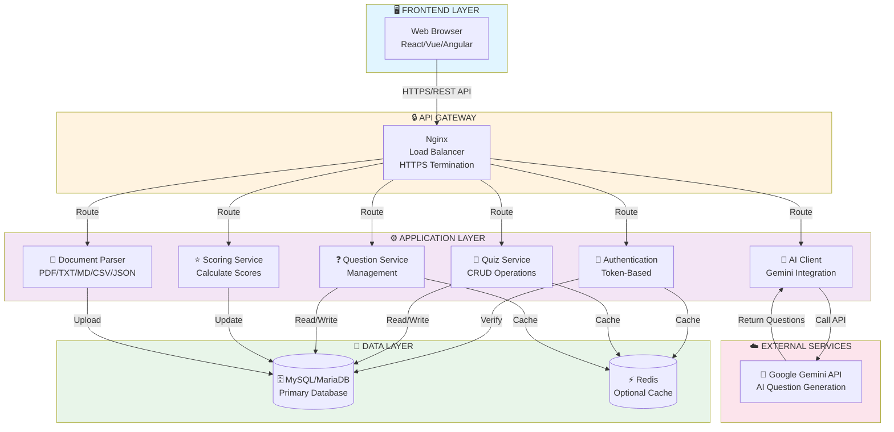

# Quick Architecture Overview
## CSE4204-8D-T04 Smart Quiz Generator

**Description:** This diagram shows a high-level overview of the Smart Quiz Generator system architecture with all major components and their interactions.



## Architecture Layers Explained

### 🖥️ **Frontend Layer**
- Web browser application (React, Vue, or Angular)
- Communicates via HTTPS REST API

### 🔒 **API Gateway Layer**
- Nginx reverse proxy
- Load balancing for scalability
- HTTPS termination and security

### ⚙️ **Application Layer (Django REST Framework)**
- **Authentication Module:** Token-based user authentication
- **Quiz Service:** Create, read, update, delete quizzes
- **Question Service:** Manage questions and options
- **Scoring Service:** Calculate and store quiz scores
- **Document Parser:** Extract text from various formats
- **AI Client:** Interface with Google Gemini API

### 💾 **Data Layer**
- **MySQL/MariaDB:** Primary relational database
- **Redis Cache:** Optional caching layer for performance

### ☁️ **External Services**
- **Google Gemini API:** AI-powered question generation

## Data Flow

```
Student/Teacher Input
        ↓
    Frontend
        ↓
   API Gateway (Nginx)
        ↓
   Application Services
        ↓
   Database & Cache
        ↓
   Response → Frontend → User
```

