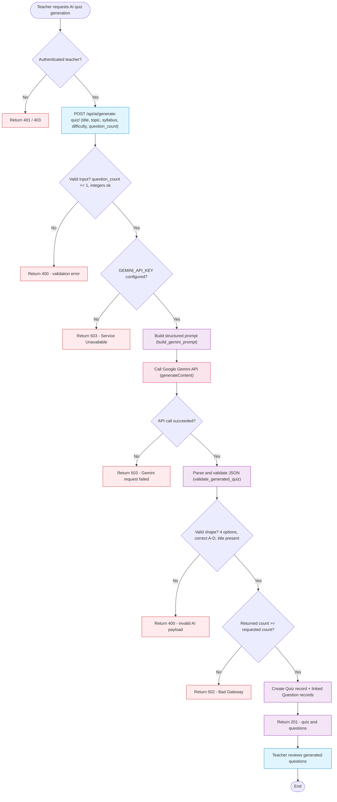
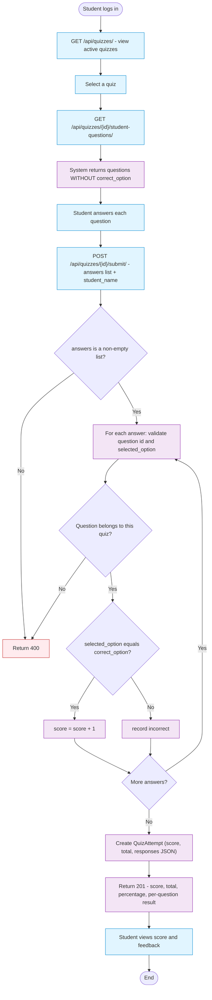
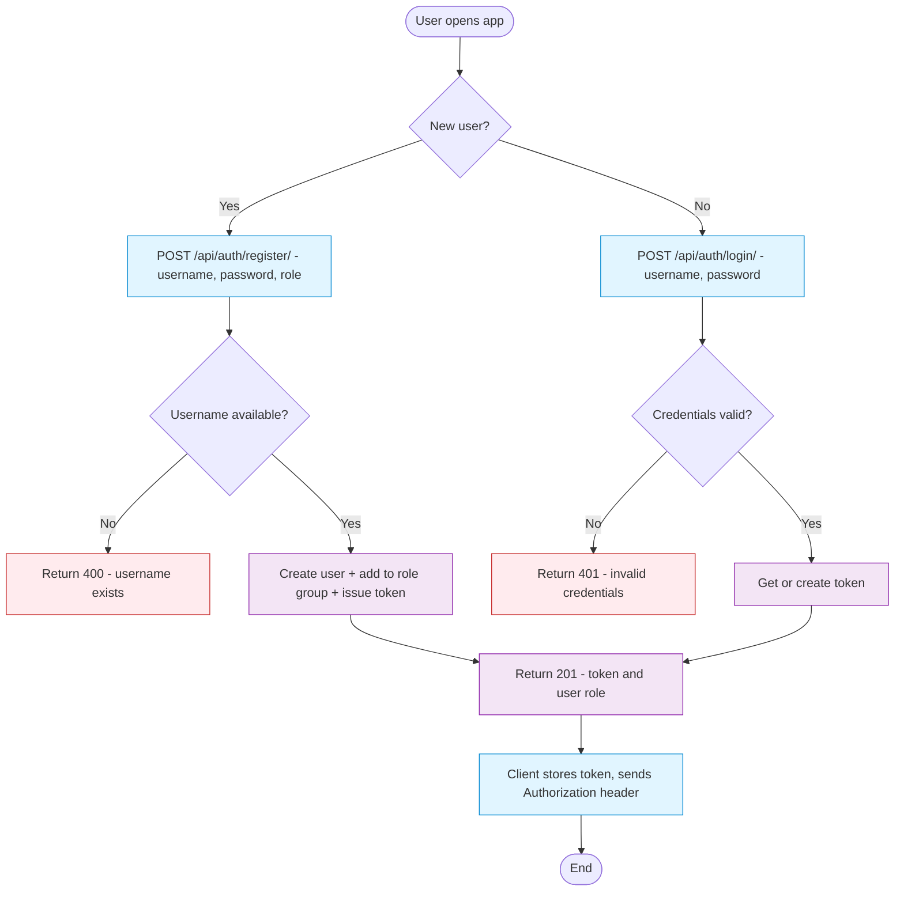
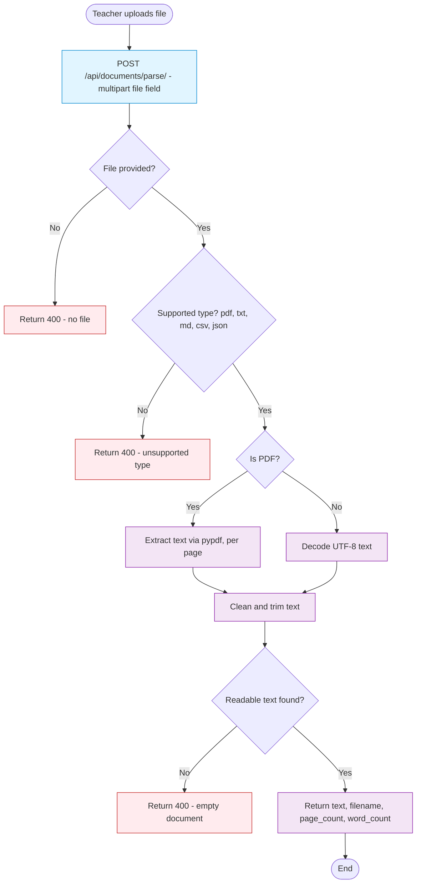

# 4. ACTIVITY DIAGRAMS
## CSE4204-8D-T04 Smart Quiz Generator

**Description:** Activity diagrams describe the step-by-step workflow of major features, showing user actions, system processes, decision points, and outputs. This document covers the four most important workflows of the Smart Quiz Generator:

1. **AI Question Generation** (primary/major feature)
2. **Student Takes & Submits a Quiz**
3. **User Registration & Login**
4. **Document Upload & Parsing**

Each diagram is drawn as a Mermaid flowchart where diamonds (`{ }`) are **decision points** and rectangles are **actions/processes**.

> **Legend:** 🟦 User action · ⚙️ System/backend process · ☁️ External AI service · 🔶 Decision point

---

## 4.1 AI Question Generation Workflow (Major Feature)

This is the flagship workflow. A teacher requests AI-generated questions; the backend builds a prompt, calls Google Gemini, validates the response, persists a `Quiz` + `Question` records, and returns them.

Backed by [`GeminiGenerateQuizView`](../backend/quiz_api/views.py) and the AI package [`generate_quiz()`](../backend/ai_integration/providers.py) (Gemini/Claude dispatcher).

**Key decision points:** authentication/role check, input validation, API-key presence, network success, AI payload shape validation, requested-count check.

---

## 4.2 Student Takes & Submits a Quiz

The student fetches answer-free questions, answers them, and submits. The backend scores the attempt server-side and stores it.

Backed by [`QuizStudentQuestionsView`](../backend/quiz_api/views.py) and [`QuizSubmitView`](../backend/quiz_api/views.py).

**Note:** Scoring is always performed on the server using the stored `correct_option`; the student-facing endpoint never exposes correct answers, preventing client-side cheating.

---

## 4.3 User Registration & Login

Registration creates a Django user, assigns a role group (`teacher`/`student`), and issues a DRF token. Login authenticates credentials and returns the token.

Backed by [`AuthRegisterView`](../backend/quiz_api/views.py) and [`AuthLoginView`](../backend/quiz_api/views.py).

---

## 4.4 Document Upload & Parsing

A teacher uploads a learning document; the backend extracts text based on file type. (Document parsing and AI generation are currently separate endpoints — see [AI Integration Workflow](../docs/CSE4204-8D-T04_AI-WORKFLOW.md).)

Backed by [`DocumentParseView`](../backend/quiz_api/views.py) and [`extract_text_from_uploaded_file()`](../backend/ai_integration/documents.py).

---

## Implementation vs. Planned

| Workflow | Status | Note |
|----------|--------|------|
| AI question generation | ✅ Implemented | Generation takes `topic`/`syllabus` text input directly. |
| Student take & submit | ✅ Implemented | Server-side scoring; responses stored as JSON. |
| Registration & login | ✅ Implemented | Username-based; role via Django Group. |
| Document parsing | ✅ Implemented | Parsing endpoint returns text only. |
| Parse → AI in one step | 🟡 Planned | SRS UC-2 describes uploading a document that directly feeds AI generation; currently parse and generate are two endpoints. |
| Logout / token invalidation | 🟡 Planned (FR-06) | No `/auth/logout/` route implemented yet. |

---

**Repository:** https://github.com/theuglyhaxor/CSE4204-8D-T04-SMART-QUIZ-GENERATOR

**Related Files (GitHub):**
- [Use Case Diagram](https://github.com/theuglyhaxor/CSE4204-8D-T04-SMART-QUIZ-GENERATOR/blob/main/diagrams/CSE4204-8D-T04_USE_CASE_DIAGRAM.md)
- [ER Diagram](https://github.com/theuglyhaxor/CSE4204-8D-T04-SMART-QUIZ-GENERATOR/blob/main/diagrams/CSE4204-8D-T04_ER-DIAGRAM.md)
- [Architecture Diagram](https://github.com/theuglyhaxor/CSE4204-8D-T04-SMART-QUIZ-GENERATOR/blob/main/diagrams/CSE4204-8D-T04_ARCHITECTURE-DIAGRAM.md)
- [AI Integration Workflow](https://github.com/theuglyhaxor/CSE4204-8D-T04-SMART-QUIZ-GENERATOR/blob/main/docs/CSE4204-8D-T04_AI-WORKFLOW.md)
