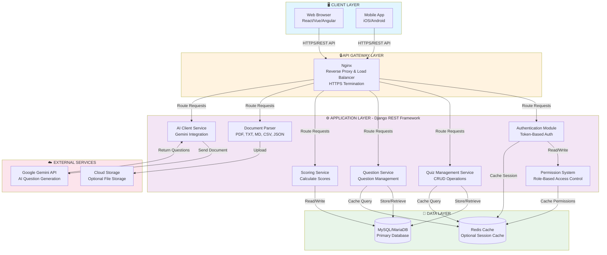

# 3. SYSTEM ARCHITECTURE DIAGRAM
## CSE4204-8D-T04 Smart Quiz Generator

**Description:** This diagram illustrates the complete system architecture organized into five layers: Presentation (Frontend), API Gateway, Application (Backend), Data, and External Services. It shows how components interact and communicate to deliver the Smart Quiz Generator functionality.

**Layers:**
1. **Presentation Layer** - User interfaces (web/mobile)
2. **API Gateway Layer** - Nginx reverse proxy
3. **Application Layer** - Django services and business logic
4. **Data Layer** - Databases and caching
5. **External Services Layer** - Third-party integrations



## Layer Components

### 🖥️ **Presentation Layer**
- **Web Browser:** React, Vue, or Angular SPA
- **Mobile App:** Native iOS/Android application
- Communication: HTTPS REST API calls

### 🔒 **API Gateway Layer**
- **Nginx Server:**
  - Reverse proxy functionality
  - Load balancing across multiple instances
  - HTTPS/SSL termination
  - Request routing and forwarding

### ⚙️ **Application Layer (Django REST Framework)**
- **Authentication Module:** Token-based user verification
- **Quiz Management Service:** Create, retrieve, update, delete quizzes
- **Question Service:** Manage quiz questions and options
- **Scoring Service:** Calculate student scores and results
- **Document Parser:** Extract text from PDF, TXT, MD, CSV, JSON
- **AI Client Service:** Interface with Google Gemini API
- **Permission System:** Role-based access control enforcement

### 💾 **Data Layer**
- **SQLite (default) or MySQL/MariaDB Database** — selected with `DB_ENGINE`:
  - auth_user, auth_group, auth_user_groups tables
  - token_blacklist_* tables (JWT refresh-token blacklist)
  - quiz_api_quiz, quiz_api_question tables
  - quiz_api_quizattempt table
  - Indexes and constraints for performance
- **Redis Cache:** (Optional)
  - Session data caching
  - Query result caching
  - Permission caching

### ☁️ **External Services**
- **Google Gemini API:** AI-powered question generation
- **Cloud Storage:** Optional S3/GCS for file uploads

## Communication Flows

```
1. User Request:
   Client → HTTPS → Nginx → Django Service → Database
   
2. Response:
   Database → Django Service → Nginx → HTTPS → Client
   
3. AI Integration:
   Document Parser → Gemini API → AI Client → Database
   
4. Caching:
   Service → Check Cache → If miss: Query DB → Store in Cache
```

## Security Features

- ✅ HTTPS/TLS encryption for all communications
- ✅ Token-based authentication (no session cookies)
- ✅ Role-based access control (RBAC)
- ✅ Input validation and sanitization
- ✅ SQL injection prevention (parameterized queries)
- ✅ Rate limiting on API endpoints

## Scalability

- ✅ Stateless backend design (horizontal scaling)
- ✅ Load balancing through Nginx
- ✅ Database caching layer
- ✅ Session-independent authentication

---

**Repository:** https://github.com/theuglyhaxor/CSE4204-8D-T04-SMART-QUIZ-GENERATOR

**Related Files (GitHub):**
- [Use Case Diagram](https://github.com/theuglyhaxor/CSE4204-8D-T04-SMART-QUIZ-GENERATOR/blob/main/diagrams/CSE4204-8D-T04_USE_CASE_DIAGRAM.md) — functional flows
- [ER Diagram](https://github.com/theuglyhaxor/CSE4204-8D-T04-SMART-QUIZ-GENERATOR/blob/main/diagrams/CSE4204-8D-T04_ER-DIAGRAM.md) — data model
- [Activity Diagram](https://github.com/theuglyhaxor/CSE4204-8D-T04-SMART-QUIZ-GENERATOR/blob/main/diagrams/CSE4204-8D-T04_ACTIVITY-DIAGRAM.md) — workflows
