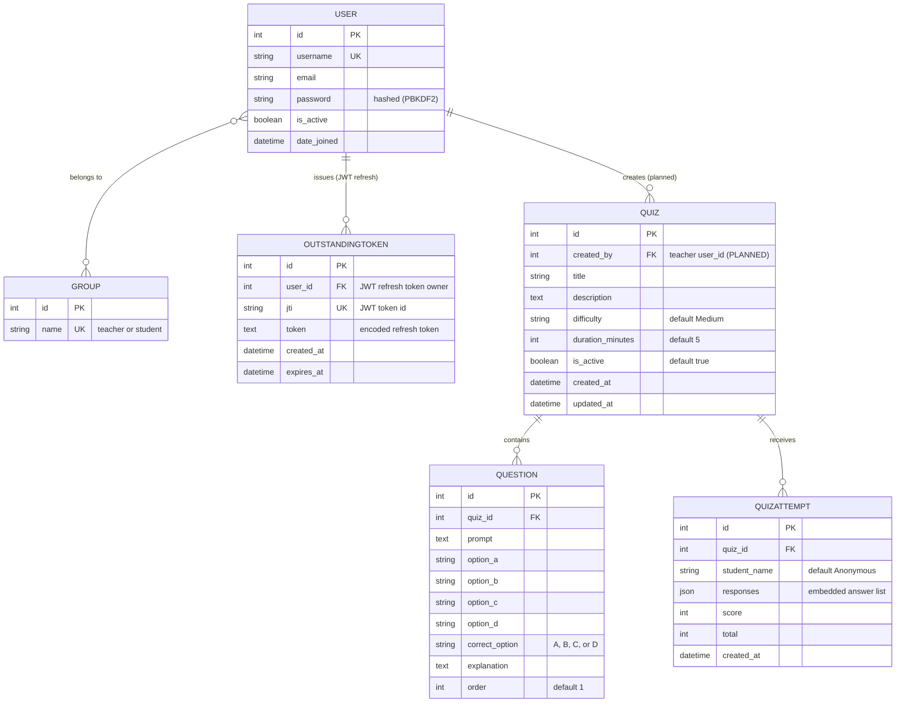

# 2. ENTITY RELATIONSHIP DIAGRAM (ER DIAGRAM)
## CSE4204-8D-T04 Smart Quiz Generator

**Description:** The ER Diagram represents the database schema of the Smart Quiz Generator. It combines the **currently implemented** Django models with the **planned** entities from the SRS (clearly marked). Authentication uses **JWT** (`djangorestframework-simplejwt`); role management reuses Django's built-in `auth_user` and `auth_group` tables, and the JWT refresh-token blacklist is stored in `token_blacklist_outstandingtoken` / `token_blacklist_blacklistedtoken`.

> **Notation:** `PK` = Primary Key · `FK` = Foreign Key · `UK` = Unique Key.
> **Status tags:** ✅ = implemented in [`models.py`](../backend/quiz_api/models.py) / Django · 🟡 = planned per SRS, not yet in code.

**Key Entities:**
- **USER** (`auth_user`) — system users (teachers and students) — *Django built-in* ✅
- **GROUP** (`auth_group`) — role groups: `teacher` / `student` — *Django built-in* ✅
- **OUTSTANDINGTOKEN** (`token_blacklist_outstandingtoken`) — issued JWT refresh tokens; blacklisted ones recorded in `token_blacklist_blacklistedtoken` — *simplejwt* ✅
- **QUIZ** — quiz metadata and configuration ✅
- **QUESTION** — MCQ content, options, correct answer, explanation ✅
- **QUIZATTEMPT** — student submissions, score, and embedded responses ✅

**Key Relationships:**
- A USER belongs to one or more GROUPs (M:N via Django `auth_user_groups`) ✅
- A USER can have many JWT refresh tokens tracked for blacklist (1:M) ✅
- A QUIZ contains many QUESTIONs (1:M) ✅
- A QUIZ receives many QUIZATTEMPTs (1:M) ✅
- A USER (teacher) *creates* many QUIZzes (1:M via `created_by`) 🟡 *planned*



## Entity Details

| Entity | DB Table | Purpose | Primary Key | Foreign Keys |
|--------|----------|---------|-------------|--------------|
| **USER** | `auth_user` | User accounts | `id` | — |
| **GROUP** | `auth_group` | Role groups (teacher/student) | `id` | — |
| **OUTSTANDINGTOKEN** | `token_blacklist_outstandingtoken` | Issued JWT refresh tokens (blacklist in `token_blacklist_blacklistedtoken`) | `id` | `user_id` |
| **QUIZ** | `quiz_api_quiz` | Quiz information | `id` | `created_by` 🟡 |
| **QUESTION** | `quiz_api_question` | Quiz questions | `id` | `quiz_id` |
| **QUIZATTEMPT** | `quiz_api_quizattempt` | Student submissions | `id` | `quiz_id` |

## Relationship Descriptions

### 1:M (authentication)
- **USER → OUTSTANDINGTOKEN:** Each login/refresh issues a JWT refresh token recorded here; logout/rotation moves it to `token_blacklist_blacklistedtoken`. Access tokens are stateless (signed JWTs) and are not stored.

### 1:M
- **USER → QUIZ** *(planned)*: A teacher owns/creates many quizzes via `created_by`. **Not yet in code** — the current `Quiz` model has no owner field, so quiz ownership/teacher-isolation (SRS §4.1) is not enforced.
- **QUIZ → QUESTION:** A quiz contains many questions (`Question.quiz` FK, `on_delete=CASCADE`).
- **QUIZ → QUIZATTEMPT:** A quiz receives many attempts (`QuizAttempt.quiz` FK, `on_delete=CASCADE`).

### M:N
- **USER ↔ GROUP:** Django maps users to groups through the `auth_user_groups` junction table. Conceptually each user is assigned exactly one role (`teacher` or `student`) at registration.

## How student answers are stored (important)

There is **no direct relational link** between `QUESTION` and `QUIZATTEMPT`. Instead, each attempt stores its answers inside the `QuizAttempt.responses` **JSON** column as a list of objects:

```json
[
  { "question": 1, "selected_option": "B", "correct_option": "B", "is_correct": true },
  { "question": 2, "selected_option": "A", "correct_option": "C", "is_correct": false }
]
```

This denormalized design (per SRS **FR-30**) keeps each attempt self-contained and avoids a separate answer table.

## Changes from the previous version

This diagram was corrected to match the actual implementation:

| Previous (incorrect) | Corrected |
|----------------------|-----------|
| `USER.email` marked as Unique Key; login by email | Login is **username-based** (Django default); email is non-unique/optional |
| `QUESTION ||--o{ QUIZATTEMPT "answered in"` (direct FK) | Removed — answers live in `QuizAttempt.responses` JSON |
| Standalone `PERMISSION` table | Permissions are enforced in code via DRF `BasePermission` classes + Django Groups, not a custom table |
| `created_by` shown as a live FK | Marked **🟡 planned** — not present in current `Quiz` model |
| `USER ||--o{ GROUP` (1:M) | Corrected to M:N (`}o--o{`) per Django's group model |

---

**Repository:** https://github.com/theuglyhaxor/CSE4204-8D-T04-SMART-QUIZ-GENERATOR

**Related Files (GitHub):**
- [Use Case Diagram](https://github.com/theuglyhaxor/CSE4204-8D-T04-SMART-QUIZ-GENERATOR/blob/main/diagrams/CSE4204-8D-T04_USE_CASE_DIAGRAM.md) — functional requirements
- [Activity Diagram](https://github.com/theuglyhaxor/CSE4204-8D-T04-SMART-QUIZ-GENERATOR/blob/main/diagrams/CSE4204-8D-T04_ACTIVITY-DIAGRAM.md) — workflows
- [Architecture Diagram](https://github.com/theuglyhaxor/CSE4204-8D-T04-SMART-QUIZ-GENERATOR/blob/main/diagrams/CSE4204-8D-T04_ARCHITECTURE-DIAGRAM.md) — system architecture
