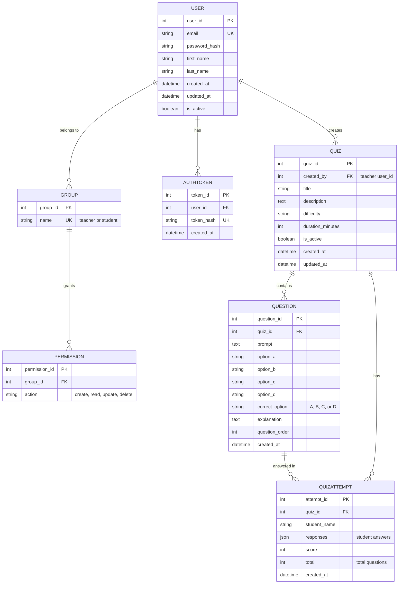

# 2. ENTITY RELATIONSHIP DIAGRAM (ER DIAGRAM)
## CSE4204-8D-T04 Smart Quiz Generator

**Description:** The ER Diagram represents the database schema showing 7 entities and their relationships. It defines the data model for the Smart Quiz Generator, including users, quizzes, questions, student attempts, authentication tokens, and role management.

**Key Entities:**
- **User** - System users (teachers and students)
- **Group** - Role management (teacher/student groups)
- **AuthToken** - Token-based authentication
- **Quiz** - Quiz metadata and configuration
- **Question** - Quiz questions with options and answers
- **QuizAttempt** - Student submissions and scores

**Key Relationships:**
- 1 User can create many Quizzes (1:M)
- 1 Quiz contains many Questions (1:M)
- 1 Quiz has many QuizAttempts (1:M)
- 1 User has 1 AuthToken (1:1)
- 1 User belongs to 1 Group (1:1)

## Entity Details

| Entity | Purpose | Primary Key | Foreign Keys |
|--------|---------|-------------|--------------|
| **USER** | User accounts | user_id | - |
| **GROUP** | Role groups (teacher/student) | group_id | - |
| **AUTHTOKEN** | Authentication tokens | token_id | user_id |
| **PERMISSION** | Access permissions | permission_id | group_id |
| **QUIZ** | Quiz information | quiz_id | created_by (user_id) |
| **QUESTION** | Quiz questions | question_id | quiz_id |
| **QUIZATTEMPT** | Student submissions | attempt_id | quiz_id |

## Relationship Descriptions

### 1:1 Relationships
- **User ↔ AuthToken:** Each user has one authentication token
- **User ↔ Group:** Each user belongs to one role group

### 1:M Relationships
- **User → Quiz:** Teachers create multiple quizzes
- **Quiz → Question:** A quiz contains many questions
- **Quiz → QuizAttempt:** A quiz receives many student attempts
- **Group → Permission:** A group has many permissions

## Data Types

- **PK** = Primary Key (unique identifier)
- **FK** = Foreign Key (references another table)
- **UK** = Unique Key (must be unique)
- **int** = Integer
- **string** = Text (varchar)
- **text** = Long text (textarea)
- **json** = JSON data format
- **datetime** = Date and time
- **boolean** = True/False

---

**Related Files:**
- See [01-USE-CASE-DIAGRAM.md](01-USE-CASE-DIAGRAM.md) for functional requirements
- See [00-ARCHITECTURE-OVERVIEW.md](00-ARCHITECTURE-OVERVIEW.md) for system architecture
