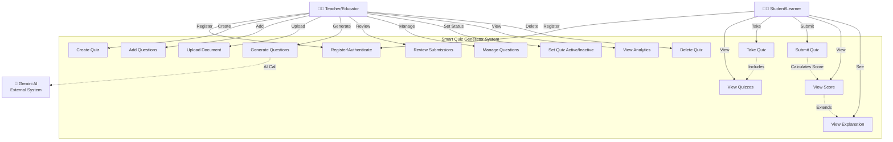

# 1. USE CASE DIAGRAM
## CSE4204-8D-T04 Smart Quiz Generator

**Description:** This Use Case Diagram shows the actors (users) and their interactions with the Smart Quiz Generator system. It identifies three main actors: Teachers, Students, and the Gemini AI service. The diagram displays 15+ use cases representing all major system functionalities.

**Key Actors:**
- 👨‍🏫 **Teacher/Educator** - Creates quizzes, manages content, reviews student submissions
- 👨‍🎓 **Student/Learner** - Takes quizzes, submits answers, views scores
- 🤖 **Gemini AI** - External system that generates questions from documents

**Use Cases Covered:**
- User authentication and registration
- Quiz creation and management
- Question generation (manual and AI-powered)
- Document upload and parsing
- Student quiz taking and submission
- Score calculation and viewing
- Analytics and reporting

## Use Case Descriptions

| Use Case | Actor | Description |
|----------|-------|-------------|
| **Register/Authenticate** | Teacher, Student | User login with email/password and token generation |
| **Create Quiz** | Teacher | Create new quiz with title, description, difficulty, duration |
| **Add Questions** | Teacher | Manually add multiple-choice questions to a quiz |
| **Upload Document** | Teacher | Upload PDF, TXT, MD, CSV, or JSON files |
| **Generate Questions** | Teacher | Use AI to auto-generate questions from documents |
| **View Quizzes** | Student | Browse list of available active quizzes |
| **Take Quiz** | Student | Answer quiz questions (without seeing correct answers) |
| **Submit Quiz** | Student | Submit answers for automatic scoring |
| **View Score** | Student | See score, percentage, and attempt results |
| **Review Submissions** | Teacher | View all student submissions and attempt details |
| **Manage Questions** | Teacher | Update or delete questions from a quiz |
| **Set Quiz Status** | Teacher | Activate or deactivate quizzes |
| **View Analytics** | Teacher | View student performance data and statistics |
| **Delete Quiz** | Teacher | Delete quiz and all associated data |
| **View Explanation** | Student | See explanation for correct answers |

## Relationships

- **Solid Lines:** Direct association (actor uses use case)
- **Dotted Lines:** Include/Extend relationships
  - `<<include>>` - Required part of another use case
  - `<<extend>>` - Optional extension of another use case

---

**Repository:** https://github.com/theuglyhaxor/CSE4204-8D-T04-SMART-QUIZ-GENERATOR

**Related Files (GitHub):**
- [ER Diagram](https://github.com/theuglyhaxor/CSE4204-8D-T04-SMART-QUIZ-GENERATOR/blob/main/diagrams/CSE4204-8D-T04_ER-DIAGRAM.md) — data model
- [Activity Diagram](https://github.com/theuglyhaxor/CSE4204-8D-T04-SMART-QUIZ-GENERATOR/blob/main/diagrams/CSE4204-8D-T04_ACTIVITY-DIAGRAM.md) — workflows
- [Architecture Diagram](https://github.com/theuglyhaxor/CSE4204-8D-T04-SMART-QUIZ-GENERATOR/blob/main/diagrams/CSE4204-8D-T04_ARCHITECTURE-DIAGRAM.md) — system architecture
