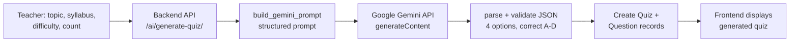

# 6. AI INTEGRATION WORKFLOW
## CSE4204-8D-T04 Smart Quiz Generator

**Description:** This document explains *why* AI is used, *which* service is used, the *input* it receives, the *output* it produces, and *how* it improves the project. It is the mandatory AI-integration deliverable. Implementation lives in the [`backend/ai_integration/`](../backend/ai_integration/README.md) package (Gemini + Claude providers) and is exposed through [`GeminiGenerateQuizView`](../backend/quiz_api/views.py).

---

## 6.1 Why AI is needed

Manually authoring multiple-choice questions is the most time-consuming part of assessment. For every quiz a teacher must write a prompt, four plausible options, mark the correct one, and write an explanation. The Smart Quiz Generator uses AI to turn a **topic + syllabus context** into a full set of validated MCQs in seconds, so teachers can focus on reviewing rather than writing.

**Benefits:**
- Cuts quiz-creation time from hours to seconds.
- Produces consistent, well-structured MCQs (always 4 options + explanation).
- Lowers the barrier for teachers who are not comfortable writing assessment items.
- Scales to many topics/difficulties without extra manual effort.

---

## 6.2 Which AI service / model is used

| Item | Value |
|------|-------|
| Provider | **Google Gemini** (default) or **Anthropic Claude** — selectable via `AI_PROVIDER` / per-request `provider` |
| Default model | Gemini: `gemini-2.5-flash` (override via `GEMINI_MODEL`); Claude: `claude-opus-4-8` (override via `CLAUDE_MODEL`) |
| Endpoint | Gemini: `https://generativelanguage.googleapis.com/v1beta/models/{model}:generateContent`; Claude: `anthropic` SDK (`messages.create`) |
| Call style | Server-side; Gemini via Python `urllib`, Claude via the `anthropic` SDK; API key from env |
| Generation config | Gemini: `temperature=0.2`, `topP=0.95`, `maxOutputTokens=8192`; Claude: `max_tokens=16000` + structured outputs |
| Timeout | Gemini: `GEMINI_TIMEOUT` seconds (default 30); Claude: SDK default |

**Security:** The `GEMINI_API_KEY` lives **only on the backend** as an environment variable. The frontend never sees it — all AI calls are proxied through the Django backend.

---

## 6.3 Input to the AI system

The teacher's request to `POST /api/ai/generate-quiz/` provides generation parameters, which `build_gemini_prompt()` turns into a structured prompt:

| Field | Meaning |
|-------|---------|
| `topic` | Subject of the quiz (e.g., "Photosynthesis") |
| `syllabus` | Optional context/material the questions should cover |
| `difficulty` | Easy / Medium / Hard |
| `question_count` | How many MCQs to generate (≥ 1) |
| `instruction` | Optional extra guidance for the model |

The prompt instructs Gemini to return **valid JSON only** (no markdown fences), with exactly 4 options per question, one correct answer, and a short explanation.

---

## 6.4 Output from the AI system

Gemini returns JSON that the backend parses (`parse_gemini_response`) and strictly validates (`validate_generated_quiz`) before saving:

```json
{
  "title": "Photosynthesis Basics",
  "questions": [
    {
      "prompt": "Which organelle carries out photosynthesis?",
      "option_a": "Mitochondria",
      "option_b": "Chloroplast",
      "option_c": "Ribosome",
      "option_d": "Nucleus",
      "correct_option": "B",
      "explanation": "Chloroplasts contain chlorophyll that captures light energy."
    }
  ]
}
```

**Validation rules enforced server-side:**
- Response must be a JSON object with a non-empty `title`.
- `questions` must be a non-empty list.
- Every question must have all 4 options (non-empty), a `prompt`, and an `explanation`.
- `correct_option` must be one of `A`, `B`, `C`, `D`.
- The number of returned questions must be ≥ the requested `question_count` (else `502`).

Valid output is persisted as one `Quiz` record plus linked `Question` records, then returned to the teacher for review.

---

## 6.5 End-to-end workflow



Text form (matching the assignment's example):

```
Teacher Input (topic + syllabus)
        ↓
Backend API (validation)
        ↓
Build structured prompt
        ↓
Google Gemini API
        ↓
Validated questions (JSON)
        ↓
Saved as Quiz + Questions
        ↓
Frontend Display / Teacher Review
```

For the full decision-point version (with error branches: 400/502/503), see [Activity Diagram §4.1](../diagrams/CSE4204-8D-T04_ACTIVITY-DIAGRAM.md#41-ai-question-generation-workflow-major-feature).

---

## 6.6 Error handling

| Condition | HTTP code | Behavior |
|-----------|-----------|----------|
| `GEMINI_API_KEY` not set | `503` | "GEMINI_API_KEY is not configured." |
| Gemini network/HTTP error | `503` | Request-failed message returned |
| Malformed / invalid AI JSON | `400` | Validation error describing the problem |
| Fewer questions than requested | `502` | "Gemini did not return the requested number of questions." |
| Bad `question_count`/`duration` | `400` | Must be integers, count ≥ 1 |

This means a Gemini outage never crashes the app — the teacher gets a clear message and can retry or author questions manually.

---

## 6.7 How AI improves the project

- **Speed:** A 10-question quiz is generated in seconds instead of being hand-written.
- **Quality & consistency:** Output is forced into a uniform, validated MCQ structure.
- **Teacher control:** AI questions are reviewed before use; the human stays in the loop.
- **Safety:** Server-side validation guarantees only well-formed questions reach the database, and the API key never leaves the backend.

---

## 6.8 Planned enhancements

- 🟡 Generate directly from an uploaded document (chain `/documents/parse/` → `/ai/generate-quiz/`) per SRS UC-2.
- 🟡 Let teachers approve/reject individual AI questions before persistence.
- 🟡 Retry/backoff on transient Gemini failures (NFR-17).

---

**Repository:** https://github.com/theuglyhaxor/CSE4204-8D-T04-SMART-QUIZ-GENERATOR

**Related Files (GitHub):**
- Setup details: [AI_INTEGRATION.md](https://github.com/theuglyhaxor/CSE4204-8D-T04-SMART-QUIZ-GENERATOR/blob/main/docs/AI_INTEGRATION.md)
- [API Design Document](https://github.com/theuglyhaxor/CSE4204-8D-T04-SMART-QUIZ-GENERATOR/blob/main/docs/CSE4204-8D-T04_API-DESIGN.md)
- [Activity Diagrams](https://github.com/theuglyhaxor/CSE4204-8D-T04-SMART-QUIZ-GENERATOR/blob/main/diagrams/CSE4204-8D-T04_ACTIVITY-DIAGRAM.md)
