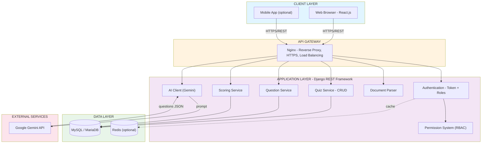
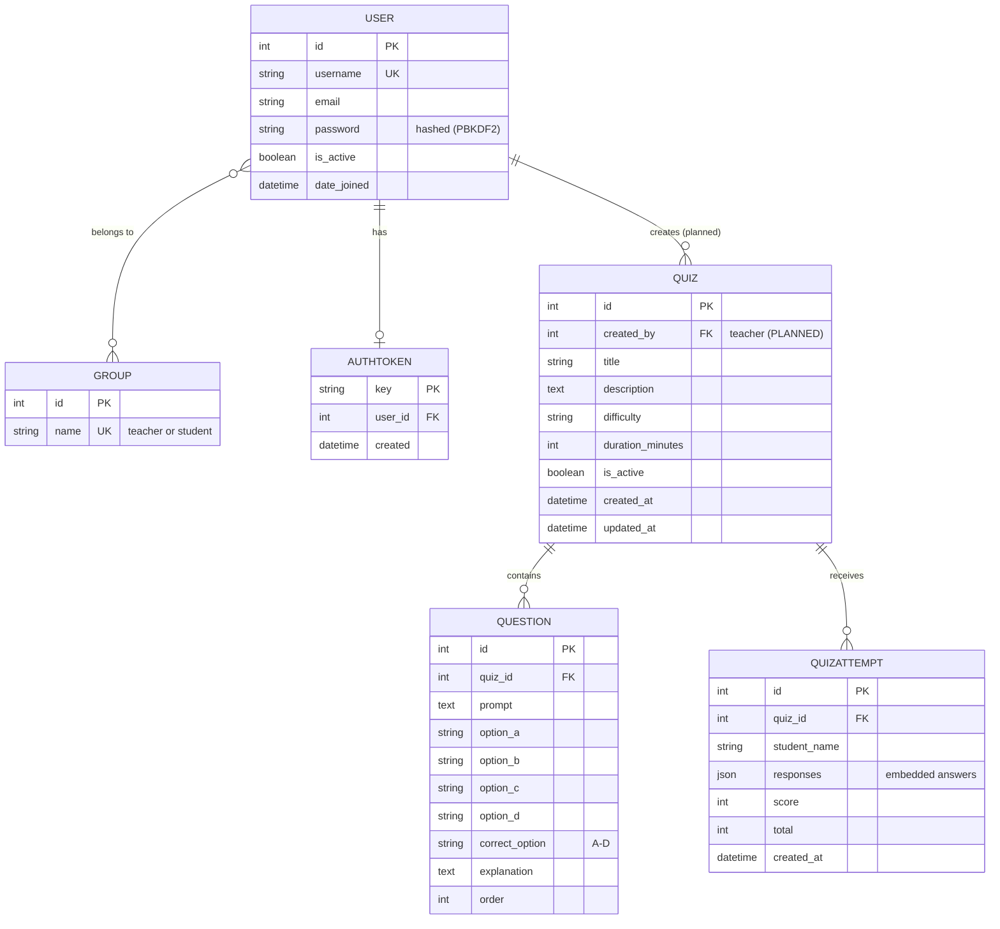
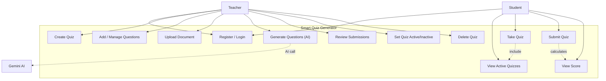
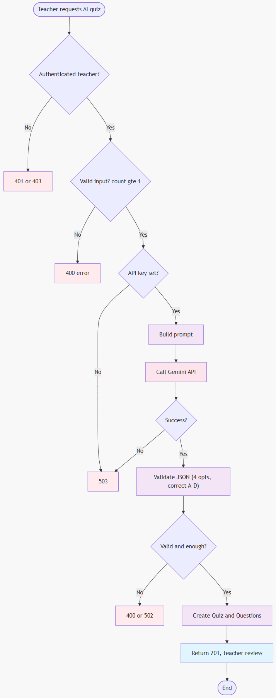
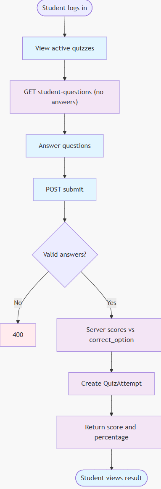
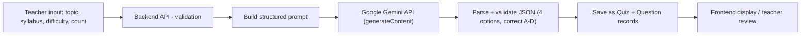

<!--
  CSE4204-8D-T04 — SYSTEM DESIGN & SOFTWARE ARCHITECTURE
  Single-file master document. Export to PDF as CSE4204-8D-T04_SystemDesign.pdf
  (VS Code "Markdown PDF" extension, or the headless-Chromium build, render the
  mermaid diagrams below). The embedded 

Department of Computer Science and Engineering

SMART QUIZ GENERATOR

System Design &amp; Software Architecture Document

An AI-assisted, role-based quiz management system that lets teachers create quizzes — manually or generated from documents via Google Gemini — and lets students take and be scored on them through a secure REST API.

<table class="cover-meta">
<tr><td>Course</td><td>CSE4204 — Mobile Computing Lab</td></tr>
<tr><td>Submission</td><td>System Design Document</td></tr>
<tr><td>Team ID</td><td>CSE4204-8D-T04 &nbsp;·&nbsp; Section 8D</td></tr>
</table>

<table class="cover-parties">
<tr>
<td>
Submitted To
Md. Riaz Mahmud 
Assistant Professor, Dept. of CSE 
Northern University of Business and Technology, Khulna
</td>
<td>
Submitted By
Team CSE4204-8D-T04 (Section 8D) 
MD Rohan · Sharmin Nahar Tumpa 
Pial Tarofdar · Sanjana Athoy
</td>
</tr>
</table>

Submission Date: 15 June 2026

## Table of Contents

1. [Team Information](#1-team-information)
2. [Project Information](#2-project-information)
3. [System Architecture Diagram](#3-system-architecture-diagram)
4. [ER Diagram (Database Design)](#4-er-diagram-database-design)
5. [Use Case Diagram](#5-use-case-diagram)
6. [Activity Diagrams](#6-activity-diagrams)
7. [API Design](#7-api-design)
8. [AI Integration Workflow](#8-ai-integration-workflow)
9. [References](#9-references)

## 1. Team Information

**Team ID:** CSE4204-8D-T04

| No. | Name | Student ID | Role / Responsibility |
|-----|------|-----------|------------------------|
| 1 | MD Rohan | 11220320958 | Backend Developer, Full Stack Development |
| 2 | Sharmin Nahar Tumpa | 11220320962 | AI Integration |
| 3 | Pial Tarofdar | 11220320965 | Frontend Developer |
| 4 | Sanjana Athoy | 11220320953 | Overall Technical Help |

---

## 2. Project Information

**Project Title:** Smart Quiz Generator

**Overview:** A role-based quiz platform with a Django REST backend. Teachers
create and manage quizzes and questions, upload documents, and use Google
Gemini to auto-generate validated multiple-choice questions. Students take
quizzes without seeing answers and receive instant, server-calculated scores.

**Technology Stack:**

| Layer | Technology |
|-------|-----------|
| Frontend | React.js (developed separately, consumes the API) |
| Backend API | Django + Django REST Framework (Python 3.9+) |
| Database | MySQL 5.7+ / MariaDB 10.3+ |
| Authentication | DRF Token authentication + Django Groups (roles) |
| AI Service | Google Gemini (`gemini-2.5-flash`, default) or Anthropic Claude (`claude-opus-4-8`) — see `backend/ai_integration/` |
| File Parsing | pypdf + UTF-8 text decoding (PDF/TXT/MD/CSV/JSON) |
| Deployment (planned) | Gunicorn + Nginx, Railway/Render |

**Scope (from SRS):** quiz CRUD, question management, AI generation, document
parsing, role-based access (teacher/student), token auth, attempt tracking and
scoring. Out of scope: production message queue, mobile app, real-time
notifications, payments.

> **Note:** Diagrams reflect the **intended SRS design**. Items planned but not
> yet in code are tagged **🟡 planned** (e.g., quiz ownership via `created_by`,
> `/auth/logout/`, document→AI chaining).

---

## 3. System Architecture Diagram

The system is organized into five layers: Client, API Gateway, Application
(Django services), Data, and External Services.

**Request flow:** `Client → HTTPS → Nginx → Django service → MySQL → response`.
**AI flow:** `Teacher input → AI Client → Gemini → validated questions → DB`.
Full detail: [Architecture Diagram on GitHub](https://github.com/theuglyhaxor/CSE4204-8D-T04-SMART-QUIZ-GENERATOR/blob/main/diagrams/CSE4204-8D-T04_ARCHITECTURE-DIAGRAM.md).

---

## 4. ER Diagram (Database Design)

`PK` = Primary Key · `FK` = Foreign Key · `UK` = Unique Key · 🟡 = planned.

Student answers are stored inside `QuizAttempt.responses` as JSON (no separate
answer table), per SRS FR-30. Full detail and the corrections log:
[ER Diagram on GitHub](https://github.com/theuglyhaxor/CSE4204-8D-T04-SMART-QUIZ-GENERATOR/blob/main/diagrams/CSE4204-8D-T04_ER-DIAGRAM.md).

---

## 5. Use Case Diagram

Actors: **Teacher**, **Student**, and the external **Gemini AI** service.

Full descriptions: [Use Case Diagram on GitHub](https://github.com/theuglyhaxor/CSE4204-8D-T04-SMART-QUIZ-GENERATOR/blob/main/diagrams/CSE4204-8D-T04_USE_CASE_DIAGRAM.md).

---

## 6. Activity Diagrams

Two primary workflows are shown below. Each diagram is kept whole on its own
page; additional workflows (Registration/Login, Document Parsing) are linked at
the end of this section.

<figure class="tall">

<figcaption><strong>6.1</strong> — AI Question Generation (major feature)</figcaption>

</figure>

<figure class="tall">

<figcaption><strong>6.2</strong> — Student Takes &amp; Submits a Quiz</figcaption>

</figure>

Additional workflows (Registration/Login, Document Parsing) and full
decision branches: [Activity Diagrams on GitHub](https://github.com/theuglyhaxor/CSE4204-8D-T04-SMART-QUIZ-GENERATOR/blob/main/diagrams/CSE4204-8D-T04_ACTIVITY-DIAGRAM.md).

---

## 7. API Design

Base URL (dev): `http://127.0.0.1:8000/api/` · Auth header: `Authorization: Bearer <access_token>` (JWT).

| Group | Method & Endpoint | Role | Purpose |
|-------|-------------------|------|---------|
| Auth | POST `/auth/register/` | public | Create user + issue token |
| Auth | POST `/auth/login/` | public | Authenticate, return token |
| Auth | POST `/auth/logout/` | token | Invalidate token |
| Quiz | GET `/quizzes/` | teacher/student | List quizzes |
| Quiz | POST `/quizzes/` | teacher | Create quiz |
| Quiz | GET/PUT/PATCH/DELETE `/quizzes/{id}/` | teacher | Retrieve/update/delete quiz |
| Question | GET/POST `/quizzes/{id}/questions/` | teacher | List / add questions |
| Question | GET/PUT/PATCH/DELETE `/questions/{id}/` | teacher | Manage a question |
| Student | GET `/quizzes/{id}/student-questions/` | teacher/student | Questions without answers |
| Student | POST `/quizzes/{id}/submit/` | student | Submit answers, get score |
| Document | POST `/documents/parse/` | teacher | Extract text from file |
| AI | POST `/ai/generate-quiz/` | teacher | Generate quiz via Gemini |
| Attempts | GET `/quizzes/{id}/attempts/` | teacher | Review submissions |

**Example — POST `/ai/generate-quiz/`:**
*Input:* `{ "topic": "Cells", "difficulty": "Medium", "question_count": 3 }`
*Output (201):* `{ "quiz": {...}, "questions": [ {...} x3 ] }`
*Errors:* `400` bad input/AI payload · `502` too few questions · `503` key missing.

Per-endpoint input/output detail: [API Design on GitHub](https://github.com/theuglyhaxor/CSE4204-8D-T04-SMART-QUIZ-GENERATOR/blob/main/docs/CSE4204-8D-T04_API-DESIGN.md).

---

## 8. AI Integration Workflow

**Why:** Writing MCQs by hand is slow; AI turns a topic + syllabus into
validated questions in seconds, with the teacher reviewing before use.

**Service:** Google Gemini (`gemini-2.5-flash`, default) or Anthropic Claude
(`claude-opus-4-8`), called server-side via the provider-agnostic
`backend/ai_integration/` package. The provider is chosen with `AI_PROVIDER` or a
per-request `provider` field. API keys (`GEMINI_API_KEY` / `ANTHROPIC_API_KEY`)
stay on the backend and are never exposed to the client.

**Validation before save:** non-empty title; non-empty questions list; every
question has 4 options, a prompt, an explanation; `correct_option ∈ {A,B,C,D}`;
returned count ≥ requested (else 502). If the key is missing or Gemini fails,
the API returns `503` with a clear message rather than crashing.

**How it improves the project:** faster quiz creation, consistent structure,
human-in-the-loop review, and safe server-side handling of the API key.

Full detail: [AI Integration Workflow on GitHub](https://github.com/theuglyhaxor/CSE4204-8D-T04-SMART-QUIZ-GENERATOR/blob/main/docs/CSE4204-8D-T04_AI-WORKFLOW.md).

---

## 9. References

- **GitHub Repository** — https://github.com/theuglyhaxor/CSE4204-8D-T04-SMART-QUIZ-GENERATOR
- Software Requirements Specification — https://github.com/theuglyhaxor/CSE4204-8D-T04-SMART-QUIZ-GENERATOR/blob/main/CSE4204-8D-T04_SRS.md
- Architecture Diagram — https://github.com/theuglyhaxor/CSE4204-8D-T04-SMART-QUIZ-GENERATOR/blob/main/diagrams/CSE4204-8D-T04_ARCHITECTURE-DIAGRAM.md
- ER Diagram — https://github.com/theuglyhaxor/CSE4204-8D-T04-SMART-QUIZ-GENERATOR/blob/main/diagrams/CSE4204-8D-T04_ER-DIAGRAM.md
- Use Case Diagram — https://github.com/theuglyhaxor/CSE4204-8D-T04-SMART-QUIZ-GENERATOR/blob/main/diagrams/CSE4204-8D-T04_USE_CASE_DIAGRAM.md
- Activity Diagrams — https://github.com/theuglyhaxor/CSE4204-8D-T04-SMART-QUIZ-GENERATOR/blob/main/diagrams/CSE4204-8D-T04_ACTIVITY-DIAGRAM.md
- API Design — https://github.com/theuglyhaxor/CSE4204-8D-T04-SMART-QUIZ-GENERATOR/blob/main/docs/CSE4204-8D-T04_API-DESIGN.md
- AI Integration Workflow — https://github.com/theuglyhaxor/CSE4204-8D-T04-SMART-QUIZ-GENERATOR/blob/main/docs/CSE4204-8D-T04_AI-WORKFLOW.md
- Django REST Framework — https://www.django-rest-framework.org/
- Google Gemini API — https://ai.google.dev/

---

*End of System Design Document — CSE4204-8D-T04 Smart Quiz Generator.*
